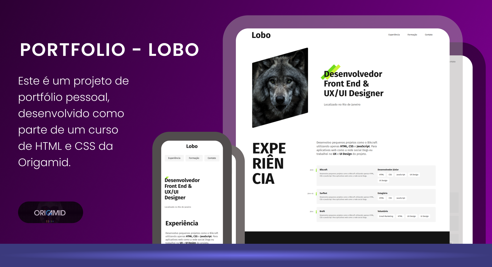

# Portfolio - Lobo

Este é um projeto de portfólio pessoal, desenvolvido como parte de um curso de HTML e CSS da Origamid. O objetivo é criar uma página web responsiva para um desenvolvedor Front-end e UX/UI Designer.

## Funcionalidades

- **Introdução:** Seção inicial com o nome, título e localização do profissional.
- **Experiência:** Detalha as experiências de trabalho anteriores, com informações sobre cargo, empresa, ano e responsabilidades. A seção inclui um texto de apresentação e uma lista de habilidades para cada experiência.
- **Formação:** Apresenta a formação acadêmica (bacharel, tecnólogo e mestrado). A seção inclui informações sobre cursos intensivos e idiomas.
- **Contato:** Um rodapé com informações de contato como e-mail, telefone e redes sociais.
- **Design Responsivo:** A página foi construída com layouts flexíveis para se adaptar a diferentes tamanhos de tela.

## Estrutura do Projeto

O projeto é composto pelos seguintes arquivos:

- `index.html`: O arquivo HTML principal que define a estrutura da página web.
- `css/`: Pasta que contém os arquivos CSS para estilização.
  - `index.css`: Arquivo principal que importa todos os outros arquivos CSS.
  - `global.css`: Define estilos globais como fontes e reset de CSS.
  - `header.css`: Estilos específicos para o cabeçalho da página.
  - `introducao.css`: Estilos para a seção de introdução.
  - `experiencia.css`: Estilos para a seção de experiência profissional.
  - `formacao.css`: Estilos para a seção de formação acadêmica.
  - `footer.css`: Estilos para o rodapé da página.
- `assets/`: Pasta para armazenar imagens e ícones utilizados no projeto, como a foto de perfil (`perfil.jpg`) e o logo (`marca.svg`).

## Como visualizar

Para visualizar o projeto, basta abrir o arquivo `index.html` em qualquer navegador web.
